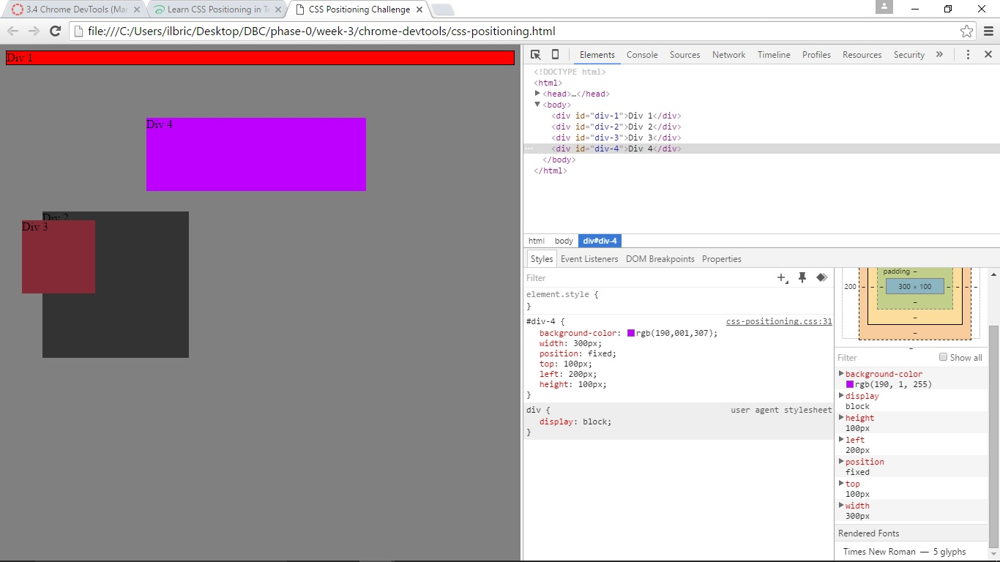
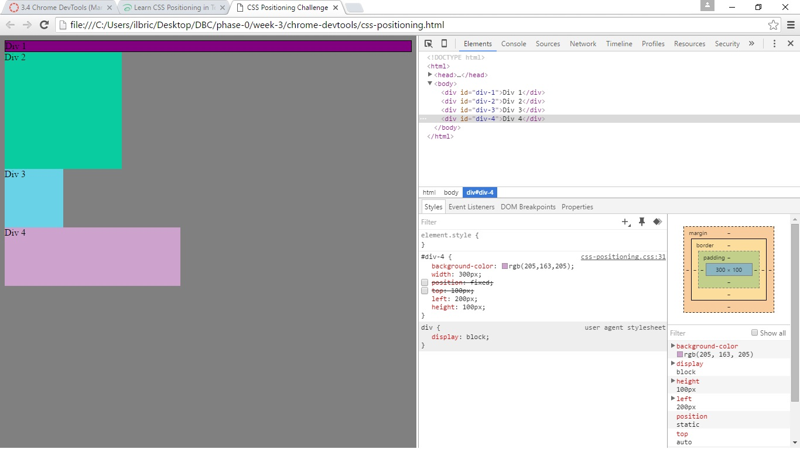
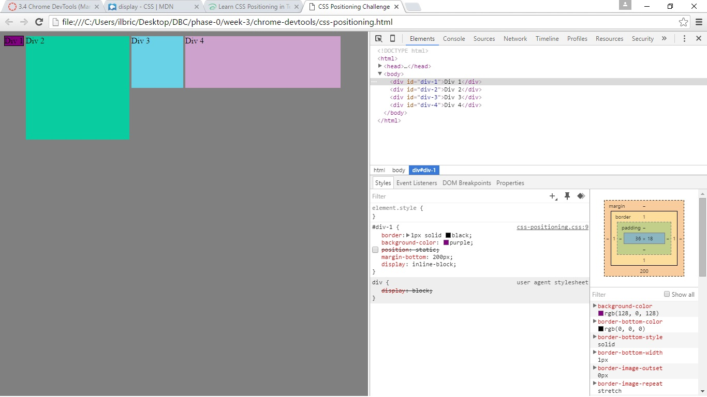
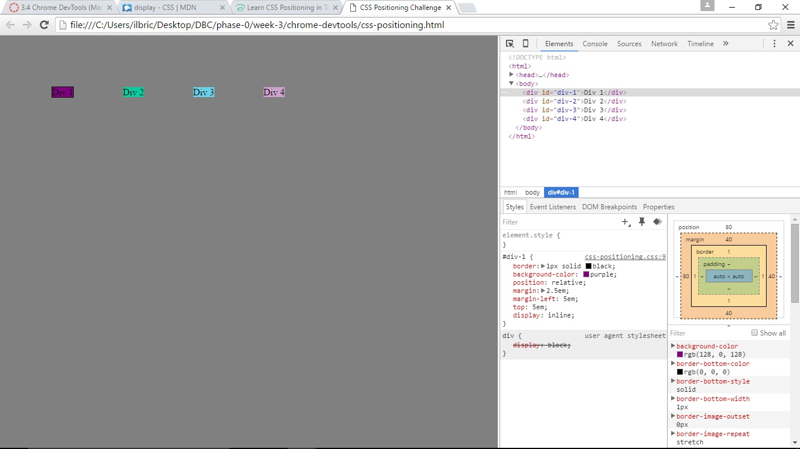
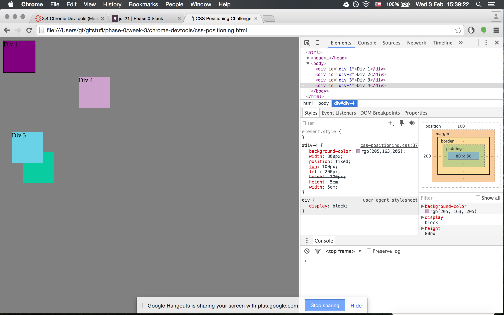
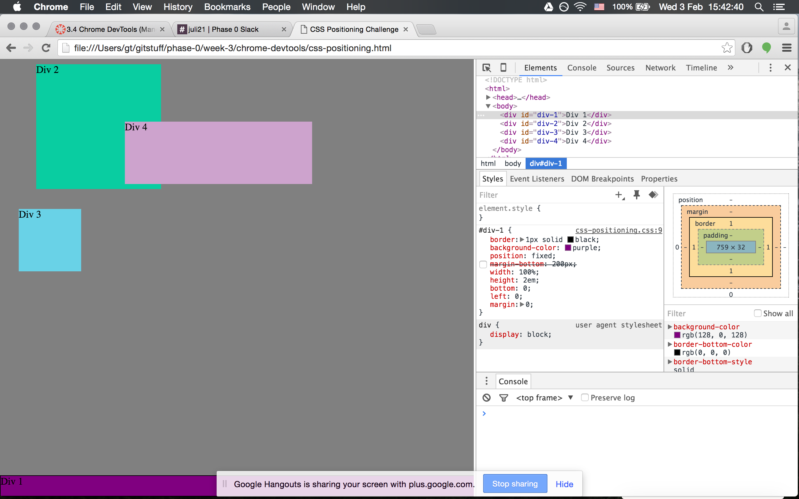
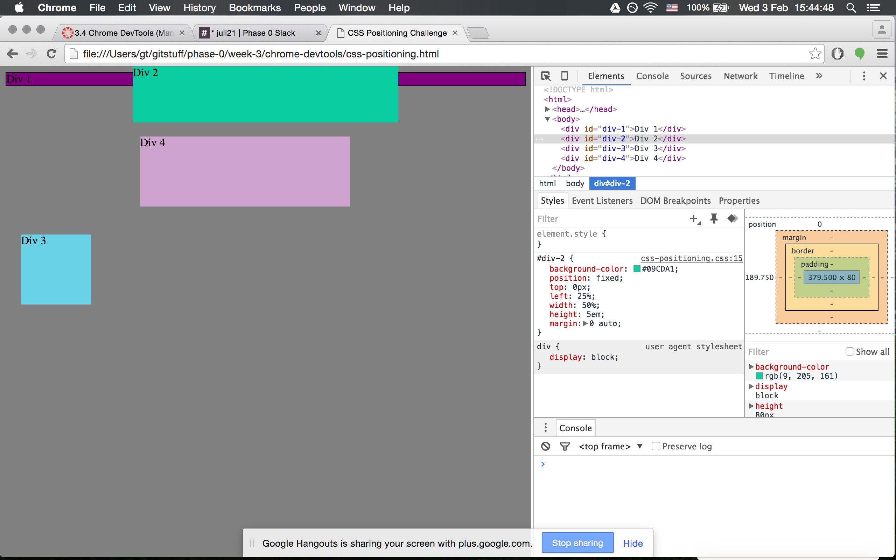
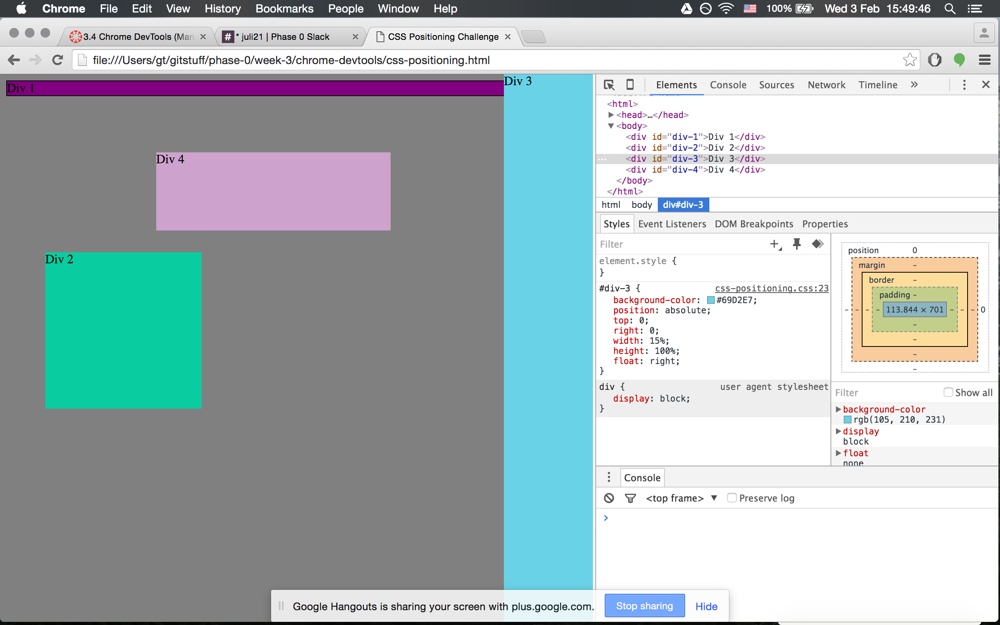
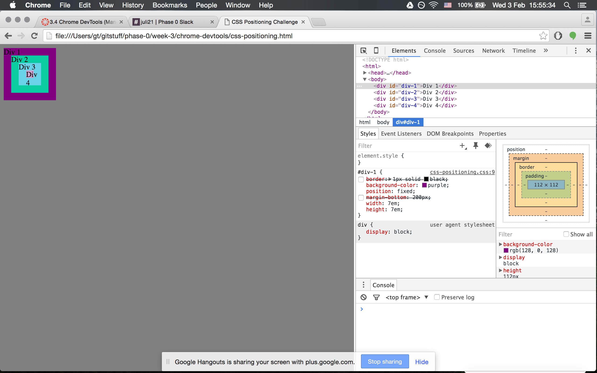

# Positioning Reflection

Here is my div box positioning reflection

## My Beautiful Div Boxes

## Reflection Questions

### How can you use Chrome's DevTools inspector to help you format or position elements?

You can experiment with different css values until you find the one that works best for the design you are trying to achieve. It is a great testing space that allows you to make and then undo changes relatively quickly and painlessly. 

### How can you resize elements on the DOM using CSS?

I used width and height properties to change the sizes of divs. In once instance, we also used the top: 0; right: 0; position: absolute; float: right; height: 100%; in order to get our div to expand to its full height.

### What are the differences between absolute, fixed, static, and relative positioning? Which did you find easiest to use? Which was most difficult?

Absolute: An element is positioned to any parent (containing) element that has a position other than static.

Fixed: Positions an element relative to the browser window.

Static: The default positioning and is unmodified. The element is located where it naturally occurrs. 

Relative: Moves an element from where it is naturally positioned in the document (static status) however much you say to move it. Elements inside a relatively positioned element will also all be positioned relative to that container.

I find fixed the most simple to use because it is simply positioned relative to the visible browser window. Any combination of relative and absolute confusess me a little bit but I think I just need to play around with them a little bit more to get comfortable using them together.

### What are the differences between margin, border, and padding?

Border: creates a visible line around an element.

Margin: adds space outside of the border between an element and a border or a sibling.

Padding: Adds space inside a border between the contents of an element and the border.

### What was your impression of this challenge overall? (love, hate, and why?)

I thought this challenge was kind of silly but I enjoyed working with my pair and it did help to clarify a few things for me. I would have preferred to actually create someething but playing around with boxes is fine too.