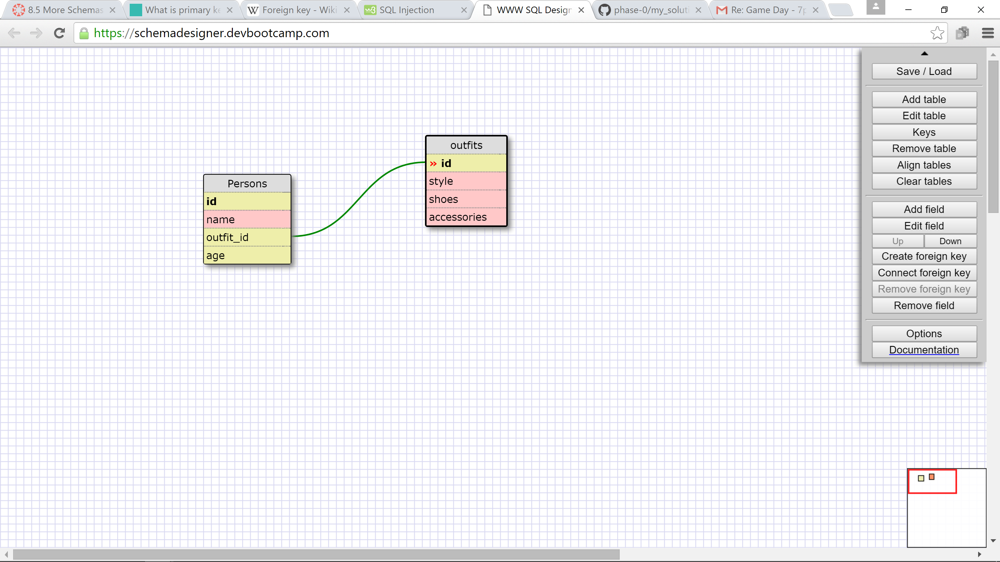

1: SELECT * FROM states;

2: SELECT * FROM regions;

3: SELECT state_name, population FROM states;

4: SELECT state_name, population FROM states ORDER BY population DESC;

5: SELECT state_name FROM states JOIN regions ON (states.regions_id=region.id) WHERE region_name=7;

6: SELECT state_name, population_density FROM states WHERE population_density > 50 ORDER BY population_density;

7: SELECT state_name FROM states WHERE population > 1000000 AND population < 1500000;

8: SELECT state_name, region_id FROM states ORDER BY region_id;

9: SELECT region_name FROM regions WHERE region_name LIKE "%Central%";

10: SELECT region_name, state_name FROM states JOIN region ON (states.region_id=region.id) ORDER BY region_id ASC;

# 8.4 Reflection:

## What are databases for?

Databases hold a huge amount of information that can be accessed, displayed, and manipulated in different ways. 

## What is a one-to-many relationship?

It is kind of akin to having a category with subcategories. The one would be a category which point to the many. The many is a number of rows in the data table that fit into the category and have the same value. For example, all shapes that are squares are rectangles but not all rectangles are squares.

## What is a primary key? What is a foreign key? How can you determine which is which?

A primary key and a foreign key are unique identifiers for each row in a data table. The value is not repeated anywhere else in that column. The primary key and the secondary key are connected so that you can pull values from two different tables if their keys have the same unique values.

## How can you select information out of a SQL database? What are some general guidelines for that?

You select based on the column title and can return the whole column or search a column for rows that match a specific value or meet certain specifications. You can also order the selected column in ascending or descending order or by another value that is present in the table but not necessarily one that you have selected.