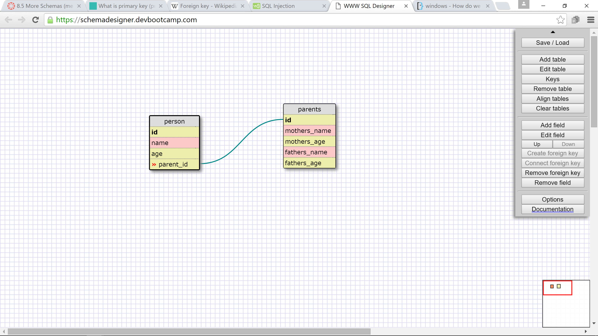
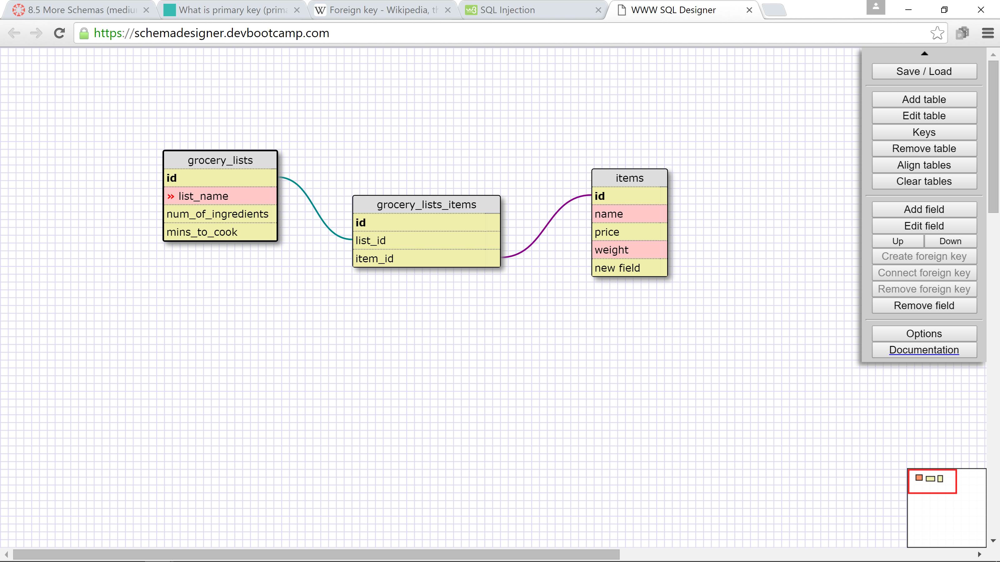

# 8.5 More Schemas

## Release 2:

## Release 4:

## Reflection:

### What is a one-to-one database?
	
	A one-to-one database is where two things have a single relationship with each other and are basically a pair. 

### When would you use a one-to-one database? (Think generally, not in terms of the example you created).

	When a thing can belong to only one item and that item can belong to only one thing. The only other option is for one of the values to be null.

### What is a many-to-many database?

	When there are two objects that each can have many values or items. 

### When would you use a many-to-many database? (Think generally, not in terms of the example you created).

	In general, I think most databases will end up being many-to-many, or at least including some many-to-many relationships within the tables. The items in each row can have many things and each of those things can belong to many items.

### What is confusing about database schemas? What makes sense?

	Everything kind of makes sense. It is just kind of difficult for me to make up theoretical database schemas when I do not need them for any real purpose. Once I have an actual database that I need to create, I think it will be much easier for me to make some schemas that make sense.